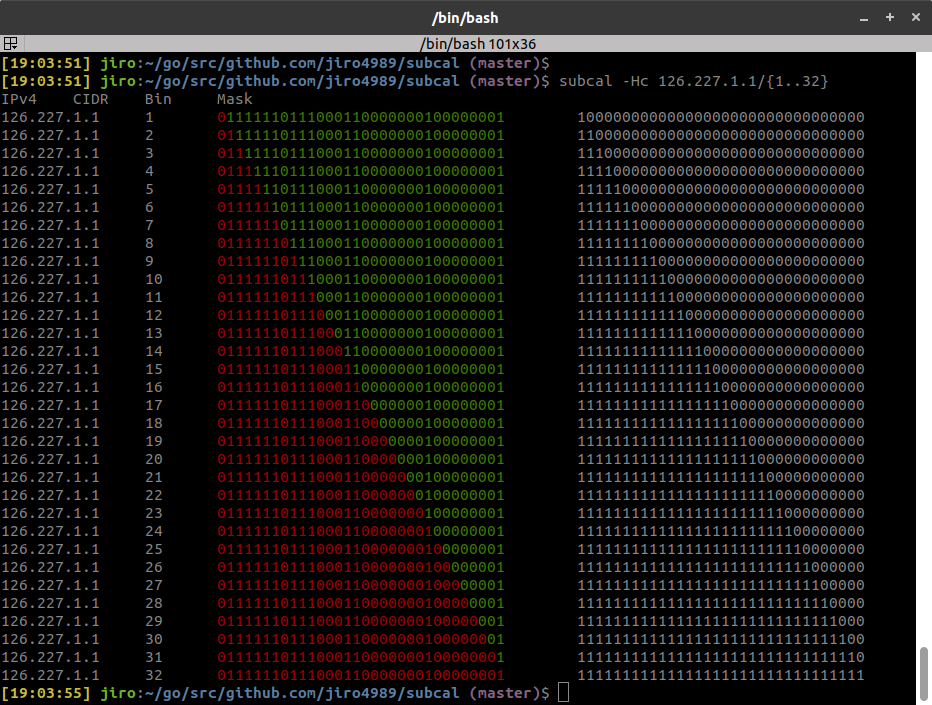
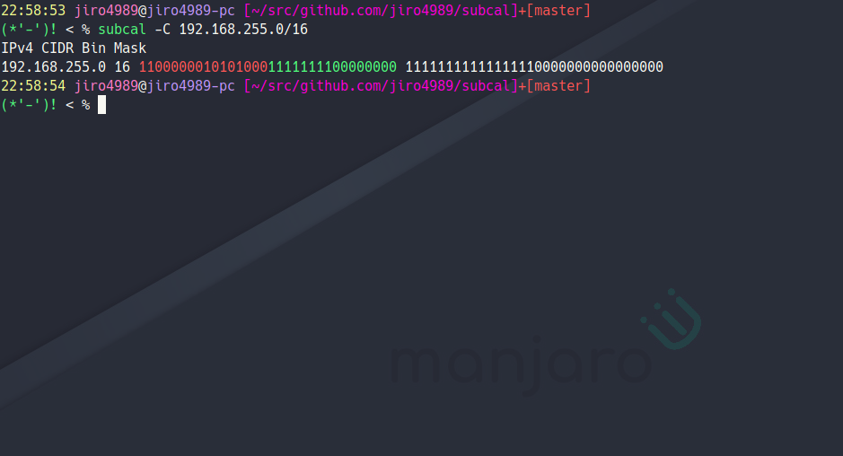

# subcal (subnet calc)

[](https://travis-ci.org/jiro4989/subcal)

subcalは10進数で記述されたIPアドレス/CIDRから2進数サブネットマスクを算出するコマンドです。

## Screenshot



## できること

* 10進数で記述されたIPアドレス/CIDRから2進数サブネットマスクを算出
* ネットワーク部とホスト部の色分け

## 使い方

```bash
$ subcal 192.168.255.0/24
IPv4 CIDR Bin Mask
192.168.255.0 24 11000000101010001111111100000000 11111111111111111111111100000000
```

```bash
$ subcal 192.168.255.0/{1..32}
IPv4 CIDR Bin Mask
192.168.255.0 1 11000000101010001111111100000000 10000000000000000000000000000000
192.168.255.0 2 11000000101010001111111100000000 11000000000000000000000000000000
192.168.255.0 3 11000000101010001111111100000000 11100000000000000000000000000000
192.168.255.0 4 11000000101010001111111100000000 11110000000000000000000000000000
192.168.255.0 5 11000000101010001111111100000000 11111000000000000000000000000000
192.168.255.0 6 11000000101010001111111100000000 11111100000000000000000000000000
192.168.255.0 7 11000000101010001111111100000000 11111110000000000000000000000000
192.168.255.0 8 11000000101010001111111100000000 11111111000000000000000000000000
192.168.255.0 9 11000000101010001111111100000000 11111111100000000000000000000000
192.168.255.0 10 11000000101010001111111100000000 11111111110000000000000000000000
192.168.255.0 11 11000000101010001111111100000000 11111111111000000000000000000000
192.168.255.0 12 11000000101010001111111100000000 11111111111100000000000000000000
192.168.255.0 13 11000000101010001111111100000000 11111111111110000000000000000000
192.168.255.0 14 11000000101010001111111100000000 11111111111111000000000000000000
192.168.255.0 15 11000000101010001111111100000000 11111111111111100000000000000000
192.168.255.0 16 11000000101010001111111100000000 11111111111111110000000000000000
192.168.255.0 17 11000000101010001111111100000000 11111111111111111000000000000000
192.168.255.0 18 11000000101010001111111100000000 11111111111111111100000000000000
192.168.255.0 19 11000000101010001111111100000000 11111111111111111110000000000000
192.168.255.0 20 11000000101010001111111100000000 11111111111111111111000000000000
192.168.255.0 21 11000000101010001111111100000000 11111111111111111111100000000000
192.168.255.0 22 11000000101010001111111100000000 11111111111111111111110000000000
192.168.255.0 23 11000000101010001111111100000000 11111111111111111111111000000000
192.168.255.0 24 11000000101010001111111100000000 11111111111111111111111100000000
192.168.255.0 25 11000000101010001111111100000000 11111111111111111111111110000000
192.168.255.0 26 11000000101010001111111100000000 11111111111111111111111111000000
192.168.255.0 27 11000000101010001111111100000000 11111111111111111111111111100000
192.168.255.0 28 11000000101010001111111100000000 11111111111111111111111111110000
192.168.255.0 29 11000000101010001111111100000000 11111111111111111111111111111000
192.168.255.0 30 11000000101010001111111100000000 11111111111111111111111111111100
192.168.255.0 31 11000000101010001111111100000000 11111111111111111111111111111110
192.168.255.0 32 11000000101010001111111100000000 11111111111111111111111111111111
```

色付き出力



## ヘルプ

```txt
subcal is a command to calculate subnet mask.

Usage:
    saubcal [options] <ip>...
    saubcal -h | --help
    saubcal -v | --version

Options:
    -h --help                     Print this help.
    -v --version                  Print version.
    -d --delimiter=<DELIMITER>    Set field delimiter. [default:  ]
    -C --color                    Colorize IP address bin.
    -i --ipv4                     Print IPv4 address.
    -c --cidr                     Print CIDR.
    -b --bin                      Print IP address bin.
    -m --mask                     Print Subnet mask.
    -n --no-header                Hide header.
```

## LICENSE

MIT
